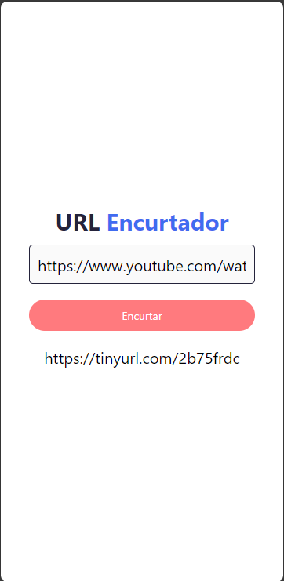

# URL Encurtador - React Native

Este é um aplicativo simples de encurtamento de URLs desenvolvido em React Native. Ele permite que os usuários insiram uma URL longa e a encurtem usando o TinyURL API.

## Funcionalidades

- Validação de URL: Verifica se a URL inserida começa com "http://" ou "https://".
- Encurtamento de URL: Usa a API do TinyURL para encurtar a URL inserida.
- Copiar para a Área de Transferência: Permite que os usuários copiem a URL encurtada para a área de transferência.

## Como usar

1. Clone este repositório:

   git clone https://github.com/Lucas-M-florentino/url-gerador.git

2. Navegue para a pasta do projeto:

    cd url-encurtador-react-native

3. Instale as dependências:

    npm install

4. Execute o aplicativo em um emulador ou dispositivo:

    npm start

## Capturas de tela

